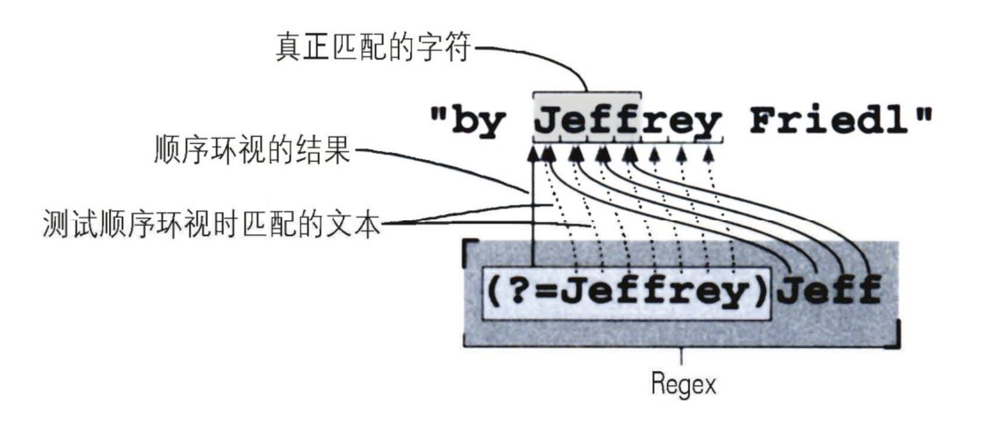
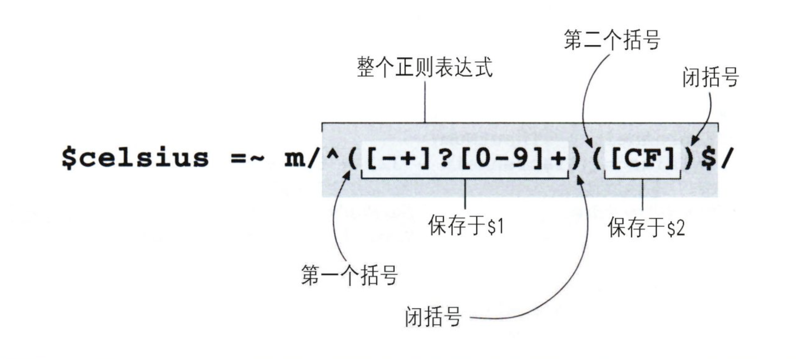
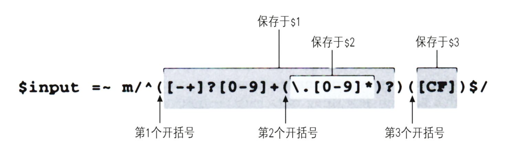
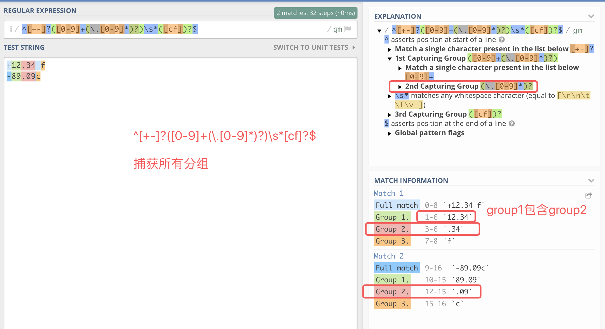
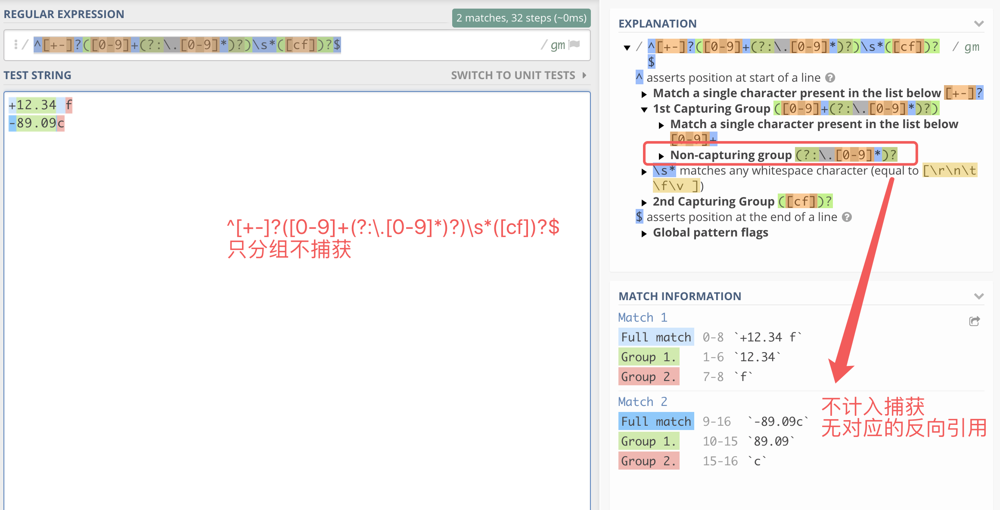
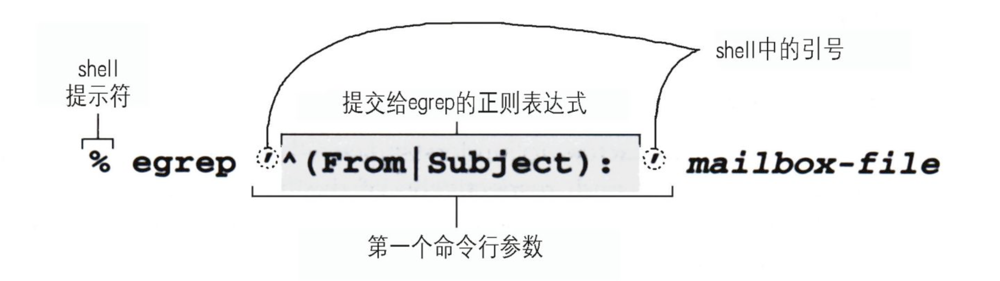
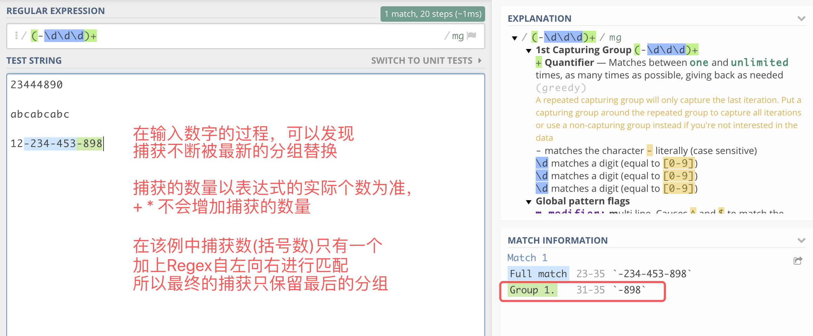

# 正则表达式

文件名模式 vs 正则表达式  
字符串中的元字符 vs 正则表达式中的元字符

**todo:**  

- Regex + Python  
- 更高级的用法

**问题:**

1. 在Apache服务器的Rewrite规则中，怎样以一个正则表达式匹配“除两个特定子域名之外的所有其他子域名“
2. 修复HTML中未闭合的tag

[参考](#reference)   
>
- [概要](#general)
- [Tips](#tip)
	- [复杂性与完整性之间的权衡](#easy)
	- [正则表达式的局限性](#unable)
- [Regex的元字符](#meta)
	- [锚定](#location)  [^, $]
		- [环视](#lookahead)
	- [字符类别](#classes) [., \w, \s]
	- [特殊空白字符](#white) [\n, \r]
	- [匹配次数](#times)  [*,?]
		- [贪婪匹配](#greedy) 
	- [字符组](#sets) [a-z]
	- [括号](#group) [括号的用处]
		- [反向引用](#reverse)
		- [嵌套分组](#nest)
		- [捕获分组](#capture)
		- [不捕获分组](#none-capture)
	- [转义符](#escape) [\\]
- [修饰符(Flags)](#flag)
- [其他语言/工具中的元字符 (有别于Regex)](#other-meta)
	- [Shell中的元字符](#shell-meta)
	- [Perl中的元字符](#perl-meta)
- [各软件/编程语言中的正则表达式](#tool)
	- [egrep](#egrep)
	- [perl](#perl)
		- [一行Perl命令](#one-line)
		- [相关语法](#perl-syntax)
- [💡示例](#examples)
	- [找出任意重复单词](#repeate)
	- [匹配双引号内的字符串](#quote) [==待解:字符串内包含\\"的情况==]
	- [匹配24小时制时间](#time)
	- [保留2位小数](#preserve)
	- [在Jeffs中添加逗号->Jeff's](#jeffs)
	- [给数值添加逗号](#num-dot)
- [🧠绞尽脑汁](#hard)
	- [分组+贪婪匹配中的捕获过程](#greedy_capture)
 

## <a id='reference'>参考</a>  
- [在线工具](https://regex101.com/) [python, golang, javascript, pcre(php)]
- [Regular expressions quick reference](https://www.computerhope.com/unix/regex-quickref.htm)
- [Computer Hope Regex](https://www.computerhope.com/jargon/r/regex.htm)
- [Python3.6: re — Regular expression operations](https://docs.python.org/3.6/library/re.html)
- [Rexegg](https://www.rexegg.com/)
- [Mastering Regular Expressions Errata](http://regex.info/errata3.html)

  
## <a id='general'>概要   
类似方言，每种工具语言都在基础上有自己的添加/改进 -->  **流派(flavor)**  
大多数编程语言中的正则表达式基于Perl的兼容正则表达式  
注意：流派和工具是2个不同的概念，2个不同的工具可能属于同样的流派；名字相同的工具可能属于不同流派。

正则表达式不易理解：  
1. 表达式写法：紧凑，不易读    
2. 各种语言的表达式语法不一样


## <a id='tip'>Tips
### <a id='easy'>复杂性与完整性之间的权衡
>
对于 12-33-90，12/33/90, 12.33.90  
regex1: `12.33.90`  
regex2: `12[-/.]33[-/.]90`   
都能匹配，但显然regex2的匹配精度更高，但也更复杂，  
regex1则简单易懂些，但会匹配除此以外的情况，e.g: 12033990  
对此，**需要在对目标文本的了解程度和检索的精确性之间取得平衡**   
即：匹配符合要求的文本，同时忽略不符合要求的文本  
如果清楚文本不会出现预期之外的情况，则使用regex1就可以了  

### <a id='unable'>正则表达式的局限性
见用例:['找出任意重复单词'](#repeate)

   
## <a id='meta'>Regex的元字符(Standard Regex)   
**元字符(metacharacter) / 元字符序列(metasequences)**:  一个字符或字符组合，预留，类似于编程语言中关键字，表示某一操作，e.g. \n表示换新行, ^表示从行首开始。要将元字符作为普通字符使用，需要'\'对其进行转义。

**普通字符**: 非元字符，注意：空格也是普通字符

### <a id='location'>锚定(Anchors and Boundaries)
>
元字符 | 意义 | 说明
------|-----|----
^ | 从行首开始
$ | 从行尾开始
\b | 单词边界 | ing\b, 匹配单词的末尾的ing； \bhe, 匹配单词首的he
\B | 非单词边界 | \Bing\B, 匹配非单词首尾部分的ing
\\< | 匹配单词首 | Python不支持, egrep支持
\\> | 匹配单词尾 | Python不支持, egrep支持	
`(?=...)` | 肯定顺序环视(positive lookahead)，匹配此后的(右侧)文本 | `abc(?=xyz)`: 匹配‘abc’，紧接着匹配位置（'abc'的左侧为'xyz'）
`(?!...)` | 否定顺序环视，不匹配此后的文本 | `abc(?!xyz)`: 匹配'abc'，紧接着匹配位置（只要'abc'的左侧不是'xyz'的都符合(包括无字符的情况)，e.g: 'abc<sub>^</sub>xui'）
`(?<=...)` | 肯定逆序环视，匹配此前的(左侧)文本 | `(?<=abc)xyz`: 匹配'abc'之后的位置，紧接着匹配‘xyz’
`(?<?...)` | 否定逆序环视，不匹配此前的文本 | `(?<!abc)xyz`: 匹配任意不是'abc'(包括无字符的情况)之后的位置，紧接着匹配'xyz'


#### <a id='lookahead'>环视</a>
> ==会匹配所有符合的位置==  
> `(?=(\d\d\d)+$)`: '12<sub>^</sub>485<sub>^</sub>987'  
> ==注意:   不管是正序还是逆序，位置匹配相当于一个插入符，与之前的匹配是紧挨着的关系==  
> e.g: `abc(?<=xyz)`, 匹配完abc后，匹配的位置之前还需有xyz，匹配的文本与位置不相邻，无法匹配到任何结果
>  
> ==环视(位置)匹配的本质: 一侧如此这般，另一侧如此那般==  
> `(?<!\w)(?=\w)|(?<=\w)(?!\2)` 等同于 `\b`


### <a id='classes'>字符类别(Character Classes)
>
元字符 | 意义 | 说明
---|---|---
. | 匹配除newline[^newline]的任意字符 | Python中newline的元字符为'\n'
\d | 匹配数字，相当于`[0-9]`
\D | 非数字，即`[^0-9]`
\s | 匹配空字符(space, tab, form feed,等) 
\S | 匹配非空字符
\w | 匹配单词字符：字母、数字和下划线， 等同于[a-zA-Z0-9_]
\W | 匹配非单词字符 | 包括\s和部分\S

### <a id='white'>特殊空白符
>
元字符 | 意义 | 说明
-----| -----|-----
\n | a newline 
\t | a tab
\r | 回车键[^cr] | 不同于newline
\v | a vertical tab
\f | a form feed, 进纸符
\b | 退格符

### <a id='times'>匹配次数(Quantifiers)
>
元字符 | 意义 | 说明
---  | ---- | ----
\* | 匹配之前的字符0次以上 | 贪婪匹配，ca*t, 表示匹配c+a+t组合，其中a可有可无，有的话可以任意多个，ct, cat, caat, caaaat
\+ | 匹配之前的字符1次以上 
? | 可选项元素，匹配之前的字符0次或1次 | 非贪婪匹配
{m} | 匹配m次 | Python中不需'\'转义'{'，直接{m}即可
{m, n} | 匹配m~n次 | Python: {m, n}
{m,} | 匹配至少m次 | Python: {m, }

#### <a id='greedy'>贪婪匹配：
```
*?, +?, ??   
The '*', '+', and '?' qualifiers are all greedy; they match as much text as possible. 
Sometimes this behaviour isn’t desired; 
if the RE <.*> is matched against '<a> b <c>', 
it will match the entire string, and not just '<a>'. 
Adding ? after the qualifier makes it perform the match in non-greedy or minimal fashion;
as few characters as possible will be matched. 
Using the RE <.*?> will match only '<a>'.
```

e.g. 匹配HTML的tag标签<xxx>：   
`<.*>` 会匹配 `<I>short</I>` 而不单单是`<I>`和`</I>`,  
因为`.*`会进行贪婪匹配

### <a id='sets'>字符组(Charater Sets and Ranges)
> **注：在字符组内部和外部，关于元字符的规定是不同的，   
> e.g.点号'.'在字符组内为普通字符，在字符组外为元字符（代表除newline外的任意字符）**
>
元字符 | 意义 | 说明
---- | ---- | ----
[字符组] | 匹配任一在字符组中的字符 |  [abcd], 匹配任一为abcd其一的字符
[^...] | 排除型字符组，匹配任一不属于字符组的字符 | [^abcd], 匹配任一不为abcd的字符；[^0-9]，匹配除数字以外的字符；**注意: 排除型字符组表示必须匹配一个未列出的字符，而不是不匹配；此处的==脱字符‘^’==(紧跟在字符组第一个方括号后)表示排除，不同于字符组外表示行开头**
[字符x-字符xx] | 匹配任一在x、xx字符之间的字符 | 字符范围由ASCII表[^ascii]定，[a-z], [0-9]; 如果范围无效，则匹配失败，x, -, xx都不会再作为普通字符进行匹配；**此处的==连字符'-'==表示范围，其他情况仍为普通字符(字符组内首位，字符组内紧跟在'[^'后，字符组外)，字符组内如要匹配连字符，则需将连字符放在字符组的首位**
reg1\|reg2 | 多选结构，或操作匹配reg1或reg2 | abc\|xyz, 匹配abc或xyz; 可以通过括号来限制多选结构的范围：c(a\|e)f，匹配caf或cef


### <a id='group'>括号:限制/分组/捕获(Group and Capture)
> **括号的作用**:  
> 1. **限制多选结构**: `gr(a|e)y`  
> 2. **分组**: 将括号内的表达式作为一个整体(字符)对待，括号内的表达式可以任意复杂, `(hello)*`匹配hello任意多次  
> 3. **反向引用(捕获)**: 捕获/引用分组匹配的内容，捕获计数同括号自左向右出现的顺序,`([a-z])([0-9])\1\2` \1引用[a-z]匹配的内容，\2引用[0-9]匹配的内容   

元字符 | 意义 | 说明
---- |  --- | ----
(...) | 分组并捕获 | Python中不需对()进行转义; (ab){3}，连续匹配ab3次
(?:...) | 只分组不捕获 | Python: (?...); (ab)cd(?:ef), 匹配abcdef, 记ab为捕获一，ef不计入捕获   

<a id='reverse'>反向引用(perl)：</a>  
> 陷阱：在原有基础上增加括号，会打破原有引用变量的编号，解决:[不捕获分组](#none-capture)
>
    
<a id='nest'>嵌套分组：</a>
>

<a id='capture'>捕获分组：</a>  
>

<a id='none-capture'>不捕获分组：</a>
>
    
### <a id='escape'>转义符
> 转义符==反斜线'\'==可以将元字符转换成普通字符，e.g. \., 匹配点   
> 转义符本身也是元字符，需要对自身进行转义才能匹配自身，\\\
> 转义符在字符组中无效 


[^newline]: newline元字符表示一行的结束和新一行的开始，在编程语言中newline用'\n'表示
[^cr]: [回车键 carriage return](https://www.computerhope.com/jargon/c/cr.htm)
[^ascii]: [ASCII表](https://www.computerhope.com/jargon/a/ascii.htm)


## <a id='flag'>修饰符(Flags)
> 放在正则表达式的末尾，用于补充   
> **注意：该功能不是正则表达式的一部分**
> 
字符 | 意义
--- | ---
i | 忽略大小写
m | 多行匹配
s | 匹配新行
x | 允许空格和注释
J | 允许重复的组名
U | 非贪婪模式


## <a id='other-meta'>其他语言/工具中的元字符 (有别于Regex)</a>
### <a id='shell-meta'>Shell中的元字符</a>
> 空格符是元字符，用来分隔命令、参数  
> 单引号是元字符，引号内的字符不被当作元字符  
> 双引号中的`$ * ?`仍视作元字符，所以变量可以在双引号中引用`“$var”`  

### <a id='perl-meta'>Perl中的元字符</a>
> `\b`：退格符

# <a id='tool'>各软件/编程语言中的正则表达式 </a>
## <a id='egrep'>Egrep
> egrep用正则表达式匹配每个文件的每一行，并显示匹配的结果；  
> **egrep在匹配前会将每一行末尾的换行符去掉；**  
> **局限性：egrep将每行文字当做一个独立部分看待，如果要匹配的对象分成了2行，则无法匹配**

> 忽略大小写: `$ egrep -i 'regex' files`

## <a id='perl'>Perl
>Perl 是一门解释型语言(脚本语言)，具有强大的文本处理功能；  
执行Perl代码，可以在命令行中通过perl解释器: $ perl 脚本，  
或者在命令行中指定代码执行 $ perl -e ‘代码’ --> **Perl-one Liners**  
结合Perl-one Liners + 其内部支持的强大Regex，可以一行命令就执行各种文本处理   
  
🔎[Linux perl command overview](https://www.computerhope.com/unix/uperl.htm)  
🔎[Perl-one Liners](https://www.rexegg.com/regex-perl-one-liners.html)  


### <a id='one-line'>一行Perl命令(Perl-one Liners, 正则匹配/替换/分割</a>

`perl  -e 'print "hello"'`  
`$ perl -e 'code' file1 file2 ...`  
`$ echo $filepath | perl -e 'code'`

> 命令参数：  
> -e 'perl code': 指定要执行的perl代码  
> -n: 将file文件内容逐行输给代码执行  
> -0777: 将换行符替换成undef，即将文件内容一次性输给代码  
> -i: 替换文件内容，将输出写入原文件   
> -p: 逐行处理文件，并打印输出   
> -w: 开启有用的警告  
> -W: 开启所有的警告
> 
> 代码用单引号包围，如果代码中包含单引号，不要用转义符，建议将包含引号的部分单独提取出来做环境变量，再在代码中引用，e.g.:  
> `env mypattern="'\w+"`           
> `perl -0777 -ne 'while(m/$ENV{mypattern}/g){print "$&\n";}' yourfile`

常用命令：  
👉`perl -i -pe 's/A/a/g' file`   
将file里的大写字母A全部换成a，并写回原文件 
 
👉`perl -pe 's/.\/imgs/..\/imgs/g' iterator.ipynb |grep imgs`   
测试: 将'./imgs'全局替换成'../imgs'的结果，grep过滤输出，只显示包含imgs的行

### <a id='perl-syntax'>相关的语法</a>
`=~`: 匹配符

 `m/regex/`: 对正则表达式进行匹配操作 

`m/regex/i`: 匹配正则表达式，不区分大小写

`s/regex/relacement/`: 将匹配内容替换成replacement  

`s/regex/replacement/i`: 不区分大小写进行匹配，匹配内容替换成replacement, i对替换内容无影响  

`s/regex/replacement/g`: 全局替换，完成第一次替换后继续搜索更多文本进行匹配替换
>
```perl   
if ($reply =~ m/^[0-9]$/):   
	print "only digits\n"    
else:  
	print "not only digits\n"  
```

`$var = <>` 逐行读入数据赋给 `$var`  
>
```perl
while ($line=<>) {  
	#process with line
}
```

`defined($var)` 检查一个变量是否设了值  
`die "...."` 发出错误信息，退出程序

## <a id='examples'>💡示例</a>
  

Regex | 意义
---   | ---
`^$`  | 匹配行开头然后是行末尾 --> 匹配空行（没有任何字符，包括空字符）
`^\s*$` | 匹配空行，并允许带任意空字符
`[a-zA-Z_][a-zA-Z_0-9]{0,31}` | 匹配标示符(变量名)，长度不超过32位  
`\(([^()]+)\)` | 匹配括号的内容
`s/^/|> /` <sub>perl替换</sub>  | 在行首插入`|> `
`<\b>http[s]?://[^\s]+\.htm[l]?<\b>` | 匹配HTTP/HTML URL, 特点:url中不存在空格


### <a id='repeate'>✍️找出任意重复单词，e.g: word word，应用场景:检查重复输入
`\b([a-zA-Z]+) +\1\b`  
>局限性：  
1. 如果重复的单词分行写，在一些工具/编程语言（比如egrep）中无法匹配；  
2. 并不是所有的重复输入都是语法错误，比如 that that, 在此基础需要人工介入再判断

### <a id='quote'>✍️匹配双引号内的字符串  
>
1、字符串不包含双引号的情况：  
`"[^"]*"` 匹配双引号内除引号之外的字符任意次   

> 2、字符串中包含双引号的情况(带\转义)，e.g.: "what about \\"x4\\"?"


### <a id='time'>✍️匹配24小时制时间 </a>
```
24小时制的范围：  
[0-9]:[0-5][0-9]
0[0-9]:[0-5][0-9]
1[0-9]:[0-5][0-9]
2[0-3]:[0-5][0-9]

提取公共部分：
小时：[01]?[0-9] 和 2[0-3]
-> ([01]?[0-9]|2[0-3]):[0-5][0-9]

或者小时部分的还可以看做：
[0-3],[4-9]
0[0-3],[4-9]
1[0-3],[4-9]
2[0-3]
提取公共部分：
-> ([0-2]?[0-3]|[01]?[4-9]):[0-5][0-9]
```

### <a id='preserve'>✍️保留2位小数</a>
> 价格显示，从浮点数中保留2位小数，不用四舍五入   
> 如果小数点后第三位不为零，则也需保留  

> `s/(\.\d\d[1-9]?)\d*/$1/g`  
> 只保留匹配到的分组，分组外匹配的数字舍弃


### <a id='jeffs'>✍️在Jeffs中添加逗号->Jeff's</a> 
> 
实现 | 说明
--- | ---
`s/\bjeffs\b/jeff's/g` | 最简单,效率最高，缺点：replacement不灵活，-i时无法应对; 未使用环视，regex占用整个文本
`s/\b(jeff)(s)\b/($1)'($2)/g` | 可应对-i； 使用反向引用，增加了复杂度，regex占用整个文本
`s/\bjeff(?=\s\b)/jeff'/g` | 不能应对-i；没有占用's', 除了展示顺序环视，没什么实用价值
`s/(?<=\bjeff)(?=s\b)/'/g` | 可应对-i, 没有占有任何文本，同时使用顺序环视和逆序环视来匹配需要插入的位置
`s/(?=s\b)(?>=\bjeff)/'/g` | 可应对-i, 各环视分子的编写可以不讲究顺序，因为最终匹配到位置是符合相邻的环视分子的重合点

> Perl One-liners:  
`$ perl -pe "s/(?<=jeff)(?=s)/'/g" file`  #代码用双引号包围

### <a id='num-dot'>✍️给数值添加逗号</a>
> 从右往左，每三位数字添加一个逗号，e.g. 1,233,566  
> `$ perl -pe 's/(?<=\d)(?=(\d\d\d)+$)/,/g' file`  
> 注意：需要全局匹配，不然只匹配一次
> `(\d\d\d)`[捕获只保留最后一个分组](#greedy_capture)，但整个表达式匹配了所有符合的位置  
> 🤔去掉`$`会怎样？  
> 更好的方式：将`$`换成`(?!\d)`, 即使如此该表达式也不是通用的，对于存在年份'1970s'的文本就不适用  
> 🤔`\D`是否等同于`(?!\d)` ？  
> 前者匹配的是字符，后者匹配的位置(否定环视不要求存在字符)   
> 🤔不用逆序环视只用顺序环视如何解决？  
> `s/(\d)(?=(\d\d\d)+(?!\d))/$1,/g`
> 


## <a id='hard'>🧠绞尽脑汁</a>
### <a id='greedy_capture'>分组+贪婪匹配中的捕获过程</a>
>
>这样的捕获一般用不上, 为避免污染其他捕获，可以忽略掉: `(?:-\d\d\d)+`